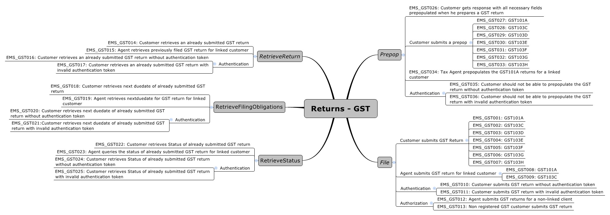

GST Returns Software Development Kit (SDK)
=======================================

Key Features:
-------------

- Simulating GST filing operations
	- Test Scenarios
	- Test Data
    - Message samples (positive responses)
    - Schema Validation
    - Error Handling
	
- Schemas and WSDLS
	- View and download the [common xsd](../Schema%20-%20Common/)
	- View and download the [return service common xsd](../Service%20-%20Return/Latest/)
	- View and download the GST return [xsd](ReturnGST.v1.xsd) and [wsdl](ReturnsGSTDevWsdl.v1.wsdl) from this current directory
	
- Returns Service 
	- [Download the build pack](../Service%20-%20Return/Latest/Gateway%20Services%20Build%20Pack%20-%20Return%20Service.pdf) to view data definitions of each operation and response status code definitions
	
- Identity and Access Service
	- [How to Integrate with OAuth](../Service%20-%20Identity%20and%20Access/Latest/OAuth%20Authentication%20-%20How%20to%20Integrate.md)
	- [Sample curl commands](../Service%20-%20Identity%20and%20Access/Latest/OAuth%20Authentication%20-%20How%20to%20Integrate.md) - for testing the OAuth flow
	- [Message Samples](../Service%20-%20Identity%20and%20Access/Latest/) - OAuth requests and responses
	- [Download the build pack](../Service%20-%20Identity%20and%20Access/Latest/Build%20pack%20-%20Identity%20and%20Access%20Services.pdf) - for OAuth 2.0 implementation   

Features Details:
-----------------

- Test Scenarios 
	- [Download test scenarios template](GST%20-%20Returns%20Service-%20Test%20Scenarios.docx)
	

- Test Data
	- This table shows which scenarios (as per their numbers in the mindmap) require specific data to trigger the expected responses. 
	- Text in italics represents the name of the XML node in the request.
	
	Operation | Scenario ID | Data
	--- | --- | ---	
	File | EMS_GST013 | Customer IRD (identifier): 123090918
	File | EMS_GST012 | Customer IRD (identifier): 123039456
	Prepop | EMS_GST027 | Customer IRD (identifier): 123039858 
	Prepop | EMS_GST028 | Customer IRD (identifier): 123084226 
	Prepop | EMS_GST029 | Customer IRD (identifier): 123084217
	Prepop | EMS_GST030 | Customer IRD (identifier): 123088077
	Prepop | EMS_GST031 | Customer IRD (identifier): 123070054 
	Prepop | EMS_GST032 | Customer IRD (identifier): 123101294
	Prepop | EMS_GST033 | Customer IRD (identifier): 123084225
	Prepop | EMS_GST034 | Customer IRD (identifier): 123080106 
        
- Message samples - simulating GST Returns Operations:
    - PrePop
        - Positive response
            - [request sample](sample%20messages/body-gst-returnprepop-request.xml)
            - [response sample](sample%20messages/body-gst-returnprepop-response.xml)
    - File
        - Positive response
            - [request sample](sample%20messages/body-gst-returnfile-request.xml)
            - [response sample](sample%20messages/body-gst-returnfile-response.xml)
    - RetrieveStatus
        - Positive response
            - [request sample](sample%20messages/body-gst-returnstatus-request.xml)
            - [response sample](sample%20messages/body-gst-returnstatus-response.xml)
    - RetrieveFilingObligations
        - Positive response
            - [request sample](sample%20messages/body-gst-filingobligation-request.xml)
            - [response sample](sample%20messages/body-gst-filingobligation-response.xml)
    - RetrieveReturn
        - Positive response
            - [request sample](sample%20messages/body-gst-retrievereturn-request.xml)
            - [response sample](sample%20messages/body-gst-retrievereturn-response.xml)

            
Requests Matching Logic
-----------------------

- ReadMe Page - (default) port 8080 of root path of Welcome Page
- Authentication mappings - (default) port 8443 of following paths:
    - /ms_oauth/oauth2/endpoints/oauthservice/authorize
    - /oam/server/auth_cred_submit
    - /ms_oauth/oauth2/endpoints/oauthservice/tokens
- Returns Service Mappings - (default) port 8080 of path "/gateway/GWS/Returns":
    - /gateway/GWS/Returns?wsdl - wsdl is not available, returning http 200 only
    - /gateway/GWS/Returns - Authentication validation will be performed at first:
        - if fail then return Authentication Errors
        - if pass then:
            - XML validation will be performed:
                - if fail then return XML Validation Errors
                - if pass then return positive responses
- Default Mapping - Very last matching logic to handle all other requests by returning 404 error when no matching found