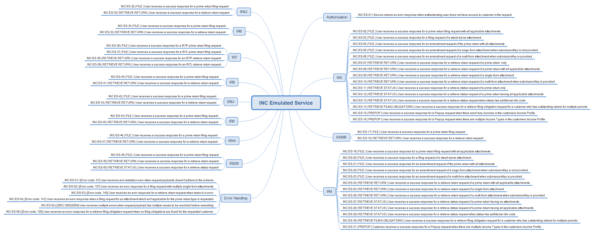

# Income Tax Software Development Kit (SDK)

## Key Documentation:

* Business use cases
	* TODO: [view on IR website](https://www.classic.ird.govt.nz/software-providers/docs/)

* XSD Schemas 
    * View and download the [Income Return Common xsd](xsd/IncomeReturnCommon.v1.xsd) from this [xsd](xsd/) directory	
    * View the Income Tax XSD schema files from the [xsd](xsd/) directory
    * View and download the [return service common xsd](../Service%20-%20Return/Latest/)
    * View and download the [common xsd](../Schema%20-%20Common/)

* [Income profile types and related forms](#Income-profile-types-and-related-forms)

* [Income Tax Form Types](#Income-Tax-Form-Types) 

* [Sample request and responses](#Sample-request-and-responses)

- Returns Service 
	- Download and view the [Return Service Income Tax build pack](Gateway%20Services%20Build%20Pack%20-%20Return%20Service%20-%20INC.pdf) to view data definitions of each operation and response status code definitions

## Environment Information: 
- [Mock Environment Information - Emulated Services, Mindmap and Test data](#mock-environment-information)
	
- [Test Environment Information - Test Scenarios Report Template, Mindmap and URL Endpoints](#test-environment-information)

- [Production Environment Information - URL Endpoints](#Production-Environment-Information)	

## Supporting Services:

* Service: Identity and Access – view [How to integrate, OAuth requests and responses message sample and build pack](../Service%20-%20Identity%20and%20Access/Latest/) 
* Service: Intermediation – view [Schemas, WSDLs, and build pack](../Service%20-%20Intermediation/)

## Income profile types and related forms:  

| Income profile type | Forms |
| --- | --- |
| NZ income with tax deducted | Individual income tax return - **IR3** _Prepop_   Non-resident income tax return - **IR3NR** |
| Schedular Payments  | Individual income tax return - **IR3** _Prepop_   Companies income tax return - **IR4**   Partnership and LTCs income tax return - **IR7**|
| Investment income  | Individual income tax return - **IR3** _Prepop_   Non-resident income tax return - **IR3NR** |
| Other expenses | Individual income tax return - **IR3** _Prepop_ |
| Net losses brought forward |   Individual income tax return - **IR3** _Prepop_   Non-resident income tax return - **IR3NR**|
| Excess imputation credits | Individual income tax return - **IR3** _Prepop_ |
| NZ income with tax deducted  | Individual income tax return - **IR3** _Prepop_ |
| NZ interest  | Companies income tax return - **IR4**   Estate or trust income tax return - **IR6**   Partnership and LTCs income tax return - **IR7**   Māori authorities income tax return - **IR8**   Clubs or societies income tax return - **IR9**| 
| NZ dividends |Companies income tax return - **IR4** Estate or trust income tax return - **IR6** Māori authorities income tax return - **IR8**  |
| Income from partnership, estate or trust  |Companies income tax return - **IR4**  Estate or trust income tax return - **IR6**|
| Losses brought from previous years | Companies income tax return - **IR4**   Estate or trust income tax return - **IR6**   Māori authorities income tax return - **IR8**   Clubs or societies income tax return - **IR9** |
| PIE | Companies income tax return - **IR4**   Partnership and LTCs income tax return - **IR7**|
| Income from a look through company | Estate or trust income tax return - **IR6**   Partnership and LTCs income tax return - **IR7**|
| Income from another partnership | Partnership and LTCs income tax return - **IR7**|
| Excess imputation credits brought forward | Clubs or societies income tax return - **IR9**|

## Income Tax Form Types:

* Companies income tax return - IR4
* Annual imputation return - IR4J 
* Estate or trust income tax return - IR6 
* Partnership and LTCs income tax return - IR7
* Māori authorities income tax return - IR8
* Māori authorities credit account return - IR8J
* Clubs or societies income tax return - IR9
* Superannuation funds income tax return - IR44
* Group investment fund return - IR44E
* Farming income - IR3F
* Schedule of business income - IR3B
* Rental income schedule - IR3R
* Sale or disposal of financial arrangements - IR3K 
* Financial statements summary - IR10
* Adjust your income - IR215
* Schedule of beneficiary’s estate or trust 
income - IR307
* Branch equivalent tax account return - IR308 
* Controlled foreign investment - CFC
* Individual income tax return - PTS  
> Note: PTS Individual income tax return RetrieveReturn and RetrieveStatus for income years prior to 2019 

## Sample request and responses

- File
    - [IR3 File request (with all applicable attachments)](sample%20messages/file_request_ir3_all_attachments.xml)
    - [IR3NR File request](sample%20messages/file_request_ir3nr_standalone.xml)
    - [IR4 File request (with all applicable attachments)](sample%20messages/file_request_ir4_all_attachments.xml)
    - [IR4J File request](sample%20messages/file_request_ir4j_standalone.xml)
    - [IR6 File request](sample%20messages/file_request_ir6_standalone.xml)
    - [IR7L File request](sample%20messages/file_request_ir7l_standalone.xml)
    - [IR7P File request](sample%20messages/file_request_ir7p_standalone.xml)
    - [IR8 File request](sample%20messages/file_request_ir8_standalone.xml)
    - [IR8J File request](sample%20messages/file_request_ir8j_standalone.xml)
    - [IR9 File request](sample%20messages/file_request_ir9_standalone.xml)
    - [IR44 File request](sample%20messages/file_request_ir44_standalone.xml)
    - [IR526 File request](sample%20messages/file_request_ir526_standalone.xml)
    - [File Response](sample%20messages/file_response.xml)
- RetrieveReturn
    - [RetrieveReturn request](sample%20messages/retrievereturn_request.xml)
    - [IR3 RetrieveReturn response](sample%20messages/retrievereturn_response_ir3.xml)
    - [IR3NR RetrieveReturn response](sample%20messages/retrievereturn_response_ir3nr.xml)
    - [IR4 RetrieveReturn response](sample%20messages/retrievereturn_response_ir4.xml)
    - [IR4J RetrieveReturn response](sample%20messages/retrievereturn_response_ir4j.xml)
    - [IR6 RetrieveReturn response](sample%20messages/retrievereturn_response_ir6.xml)
    - [IR7L RetrieveReturn response](sample%20messages/retrievereturn_response_ir7l.xml)
    - [IR7P RetrieveReturn response](sample%20messages/retrievereturn_response_ir7p.xml)
    - [IR8 RetrieveReturn response](sample%20messages/retrievereturn_response_ir8.xml)
    - [IR8J RetrieveReturn response](sample%20messages/retrievereturn_response_ir8j.xml)
    - [IR9 RetrieveReturn response](sample%20messages/retrievereturn_response_ir9.xml)
    - [IR44 RetrieveReturn response](sample%20messages/retrievereturn_response_ir44.xml)
    - [IR526 RetrieveReturn request](sample%20messages/retrievereturn_request_ir526.xml)
    - [IR526 RetrieveReturn response](sample%20messages/retrievereturn_response_ir526.xml)
- RetrieveReturn
    - [RetrieveStatus request](sample%20messages/retrievestatus_request.xml)
    - [RetrieveStatus response](sample%20messages/retrievestatus_response.xml)
    - [IR526 RetrieveStatus request](sample%20messages/retrievestatus_request_ir526.xml)
    - [IR526 RetrieveStatus response](sample%20messages/retrievestatus_response_ir526.xml)
- Prepop
    - [Prepop request](sample%20messages/prepop_request.xml)
    - [Prepop response (Individual customer)](sample%20messages/prepop_response_individual.xml)
    - [Prepop response (Non-Individual customer)](sample%20messages/prepop_response_nonindividual.xml)
- RetrieveFilingObligations
    - [RetrieveFilingObligations request](sample%20messages/retrievefilingobligations_request.xml)
    - [RetrieveFilingObligations response](sample%20messages/retrievefilingobligations_response.xml)

## Mock Environment Information
---
- Mock Emulated Services URL
    - Landing page: https://mock-inc.ird.digitalpartner.services
    - Service endpoint: https://mock-inc.ird.digitalpartner.services/gateway/GWS/Returns/
- Test Scenarios
    - Income Tax Mock Scenarios Mindmap
    [Mock Scenarios](images/income-tax-test-scenarios.png)
     
- Test Data
    - This table shows which scenarios (as per their numbers in the mindmap) require specific data to trigger the expected responses.
    - Text in italics represents the name of the XML node in the request.
    
<table>
    <tbody>
        <tr>
            <th></th>
            <th>Scenario ID</th>
            <th>Operation</th>
            <th>Data</th>
        </tr>
        <tr>
            <th rowspan="5">IR3</th>
            <td>INC-ES-08</td>
            <td>RetrieveReturn</td>
            <td>Customer IRD (<em>identifier</em>): 132310297</td>
        </tr>
        <tr>
            <td>INC-ES-12</td>
            <td>RetrieveStatus</td>
            <td>Customer IRD (<em>identifier</em>): 132310297</td>
        </tr>
        <tr>
            <td>INC-ES-13</td>
            <td>RetrieveStatus</td>
            <td>Customer IRD (<em>identifier</em>): 070876272</td>
        </tr>
        <tr>
            <td>INC-ES-15</td>
            <td>Prepop</td>
            <td>Customer IRD (<em>identifier</em>): 015679840</td>
        </tr>
        <tr>
            <td colspan="2">All other scenarios</td>
            <td>Customer IRD (<em>identifier</em>): 132306907</td>
        </tr>
        <tr>
            <th>IR3NR</th>
            <td colspan="2">All scenarios</td>
            <td>Customer IRD (<em>identifier</em>): 093989910</td>
        </tr>
        <tr>
            <th rowspan="4">IR4</th>
            <td>INC-ES-24</td>
            <td>RetrieveReturn</td>
            <td>Customer IRD (<em>identifier</em>): 132329362</td>
        </tr>
        <tr>
            <td>INC-ES-28</td>
            <td>RetrieveStatus</td>
            <td>Customer IRD (<em>identifier</em>): 132329362</td>
        </tr>
        <tr>
            <td>INC-ES-29</td>
            <td>RetrieveStatus</td>
            <td>Customer IRD (<em>identifier</em>): 107031227</td>
        </tr>
        <tr>
            <td colspan="2">All other scenarios</td>
            <td>Customer IRD (<em>identifier</em>): 096062311</td>
        </tr>
        <tr>
            <th>IR4J</th>
            <td colspan="2">All scenarios</td>
            <td>Customer IRD (<em>identifier</em>): 078445386</td>
        </tr>
        <tr>
            <th>IR6</th>
            <td colspan="2">All scenarios</td>
            <td>Customer IRD (<em>identifier</em>): 079945793</td>
        </tr>
        <tr>
            <th rowspan="4">IR7</th>
            <td>INC-ES-36</td>
            <td>File</td>
            <td>Customer IRD (<em>identifier</em>): 019515842</td>
        </tr>
        <tr>
            <td>INC-ES-37</td>
            <td>File</td>
            <td>Customer IRD (<em>identifier</em>): 105493711</td>
        </tr>
        <tr>
            <td>INC-ES-38</td>
            <td>RetrieveReturn</td>
            <td>Customer IRD (<em>identifier</em>): 019515842</td>
        </tr>
        <tr>
            <td>INC-ES-39</td>
            <td>RetrieveReturn</td>
            <td>Customer IRD (<em>identifier</em>): 105493711</td>
        </tr>
        <tr>
            <th>IR8</th>
            <td colspan="2">All scenarios</td>
            <td>Customer IRD (<em>identifier</em>): 050700461</td>
        </tr>
        <tr>
            <th>IR8J</th>
            <td colspan="2">All scenarios</td>
            <td>Customer IRD (<em>identifier</em>): 113613831</td>
        </tr>
        <tr>
            <th>IR9</th>
            <td colspan="2">All scenarios</td>
            <td>Customer IRD (<em>identifier</em>): 056632778</td>
        </tr>
        <tr>
            <th>IR44</th>
            <td colspan="2">All scenarios</td>
            <td>Customer IRD (<em>identifier</em>): 052120330</td>
        </tr>
        <tr>
            <th>IR526</th>
            <td colspan="2">All scenarios</td>
            <td>Customer IRD (<em>identifier</em>): 055786372</td>
        </tr>
        <tr>
            <th>Authorisation</th>
            <td>INC-ES-01</td>
            <td>All</td>
            <td>Customer IRD (<em>identifier</em>): 111001111</td>
        </tr>
        <tr>
            <th rowspan="5">Error Scenarios</th>
            <td>INC-ES-52</td>
            <td>File</td>
            <td>Return with multiple IR10 attachments</td>
        </tr>
        <tr>
            <td>INC-ES-53</td>
            <td>RetrieveReturn</td>
            <td>Customer IRD (<em>identifier</em>): 107031227</td>
        </tr>
        <tr>
            <td>INC-ES-54</td>
            <td>File</td>
            <td>IR9 return with IR307 attachment</td>
        </tr>
        <tr>
            <td>INC-ES-55</td>
            <td>File</td>
            <td>IR3 return with: 
                <em>totalPAYEDeducted</em> &gt; <em>totalGrossIncome</em> 
                <em>totalIncomeNotLiableForACCLevy</em> &gt; <em>totalGrossIncome</em> 
                <em>totalExtinguishedTCPDs</em> &gt; <em>totalTCPDs</em>
            </td>
        </tr>
        <tr>
            <td>INC-ES-56</td>
            <td>RetrieveFilingObligations</td>
            <td>Customer IRD (<em>identifier</em>): 078650362</td>
        </tr>
    </tbody>
</table>
    

## Test Environment Information:
-----------------

* Test Scenarios
	- [Download test scenarios report template](INC%20-%20Return%20Service%20-%20Test%20Report%20Template.docx)

* Test Environment URL Endpoints
	
	* Cloud Gateway Service: `https://test3.services.ird.govt.nz:4046/gateway/gws/returns/`
	* Native Desktop Gateway Service: `https://test3.services.ird.govt.nz/gateway2/gws/returns/`
	* Cloud SOAP WSDL: `https://test3.services.ird.govt.nz:4046/gateway/gws/returns/?wsdl`
	* Native Desktop SOAP WSDL: `https://test3.services.ird.govt.nz/gateway2/gws/returns/?wsdl`
            
## Production Environment Information:
-----------------

* Production URL Endpoints

	- Cloud Gateway Service: `https://services.ird.govt.nz:4046/gateway/gws/returns/`
	- Native Desktop Gateway Service: `https://services.ird.govt.nz/gateway2/gws/returns/`
	- (Cloud) SOAP WSDL: `https://services.ird.govt.nz:4046/gateway/gws/returns/?wsdl`
	- (Native Desktop) SOAP WSDL: `https://services.ird.govt.nz/gateway2/gws/returns/?wsdl`