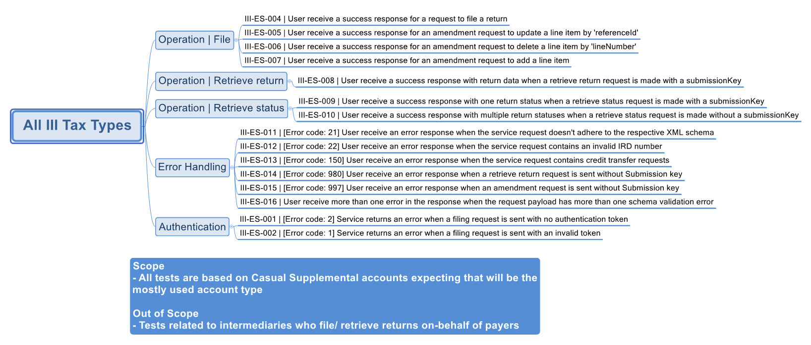

# Investment Income Reporting - Testing Information

- The testing details provided on this page is applicable for all of the following invest income reporting tax types
	- Approved Issuer Levey (AIL)
	- Dividend Withholding Tax (DWT)
	- Interest Pay as you go (IPS)
	- Non Resident Withholding Tax (NRT) 
	- Resident Withholding Tax (RWT)

- Mock Environment Information
	- [Mindmap and test data](#mock-environment-information)
	- [Requests Matching Logic](#mock-environment-requests-matching-logic)
	
Mock Environment Information:
-----------------

- Investment Income Reporting Mock Scenarios Mindmap
	
	- [View larger image](images/IIR_Mock_Scenarios_Mindmap.png)
	

- Test Data
	- The following test data can be tested in our Mock Services environment when submitting requests to the service operations for the following invest income reporting tax types (AIL / DWT/ IPS/ NT / RWT)
	
		- Valid Identifiers per tax type:
			- AIL: 	[123768566, 132145202]
			- DWT:	[123769066, 132145202]
			- IPS: 	[123752058, 132145202]
			- NRT: 	[123768973, 132145202]
			- RWT: [123768736, 132145202]

		- Valid Submission Keys:
			- these can be used across all IIR tax types and operations:
			- [294502400, 1333370880, 463962112, 1859829760, 1699905536, 1154154496, 1783480320]
			
		- Valid Primary IRD numbers: [123671791, 123769651] 
		
	- This following table shows which scenarios (as per their numbers in the mindmap) require specific data to trigger the expected responses.
	- Text in italics represents the name of the XML node in the request.
	-
	
	Scenario ID | Test Module | Example Data | Remarks
	--- | --- | --- | ---
	III-ES-004 | Operation - File | Customer IRD (*identifier*): 132145202 | set valid IRD number / identifier value
	III-ES-005 | Operation - File | Reference ID: 11 | set reference Id, amendType: U
	III-ES-006 | Operation - File | Line Number: 5312572871 | set lineNumber, amendType: D
	III-ES-007 | Operation - File | Customer IRD (*identifier*): 132145202 | amendType: A
	 | | | 
	III-ES-008 | Operation - Retrieve Return | Submission Key: 294502400 | include submissionKey
	 | | | 
	III-ES-009 | Operation - Retrieve Status | Submission Key: 1333370880 | include submissionKey
	III-ES-010 | Operation - Retrieve Status | - | do not set submission key in request
	 | | | 
	III-ES-011 | Error Handling | minorFormType: " | set empty value for minorFormType
	III-ES-012 | Error Handling | identifier: 123456789 | set Identifier value
	III-ES-013 | Error Handling | - | include creditTransferRequest element in request payload
	III-ES-014 | Error Handling | - | no submission key in retrieve request payload
	III-ES-015 | Error Handling | - | no submission key in amend request payload
	III-ES-016 | Error Handling | majorFormType: '' minorFormType: '' | set empty value for majorFormType and minorFormType
	 | | | 
	III-ES-001 | Authentication | - | set no authentication token
	III-ES-002 | Authentication | - | set invalid authentication token

			
Mock Environment - Requests Matching Logic:
-----------------

- Returns Service Mappings - (default) port 443 of path "/gateway/GWS/Returns":
	- /gateway/GWS/Returns?wsdl - wsdl is not available, returning http 200 only.
	
- WS-addressing action header value of the incoming request is mapped to an endpoint:
	- FileReturns 		-	https://services.ird.govt.nz/GWS/Returns/Return/File
	- RetrieveReturns 	-	https://services.ird.govt.nz/GWS/Returns/Return/RetrieveReturn
	- RetrieveStatus 	-	https://services.ird.govt.nz/GWS/Returns/Return/RetrieveStatus
	 
- Authentication: 
	- Authentication is based on the outcome of OAuth token validation (using new OAuth emlator)
	- Incoming requests should include "Authorization" header with the OAuth token value
	- Incase of missing token, emulated service would respond with error statusCode 2

- Schema Validations:
	- incase of failure xml validation failure response (error code 21)

- Account type value is then verified to asses it is valid III product request.
	- if not, an invalid account type error is returned.

- Then the service operation specific validations are carried out and returned with appropriate response (per mind map).

- Unmatched requests will return an appropriate HTTP response status
