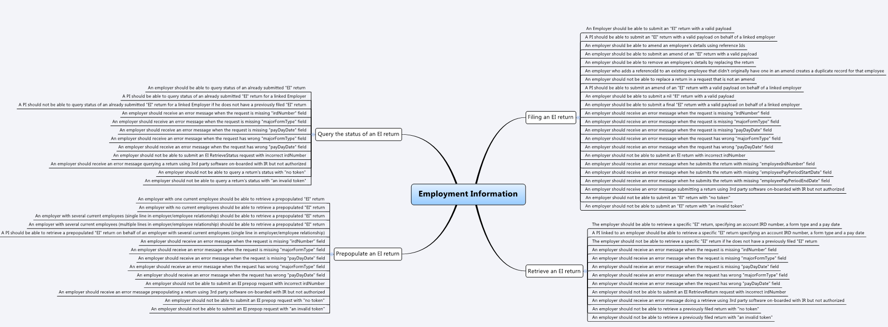

Employment Information (EI) Returns Software Development Kit (SDK)
=======================================

Key Documentation:
-------------

- Simulating Employment Information (EI) filing operations
	- [Test scenarios report template, mindmap and data](#test-details)
    - [Message samples](#message-samples-) - positive responses
	- [Requests Matching Logic](#requests-matching-logic)

- Business use cases
	- [view on IR website](https://www.ird.govt.nz/resources/9/5/95275fd7-967a-4b87-877f-a8968807e45e/Payday+filing+-+Employment+Information+business+use+cases.pdf)
	
- Schemas and WSDLs
	- View and download the [common xsd](../../Schema%20-%20Common/)
	- View and download the [return service common xsd](../../Service%20-%20Return/Latest/)
	- View and download the Employment Income (EI) return [XSD](ReturnEI.v1.xsd) and [WSDL](ReturnsEIDevWsdl.wsdl) from this current directory
	
- Returns Service 
	- [Download the build pack](../../Service%20-%20Return/Latest/Gateway%20Services%20Build%20Pack%20-%20Return%20Service%20-%20EI.pdf) to view data definitions of each operation and response status code definitions
	
## Environments Information: 

- Mock Environment Information
	- [Mindmap and test data](#mock-environment-information)
	- [Requests Matching Logic](#mock-environment-requests-matching-logic)
	
- Test Environment Information
	- [Test scenarios report template and mindmap](#test-environment-information)

- Production Environment Information
	- [Production URL Endpoint](#Production-URL-Endpoint)

- Find out about [Employee Details SDK, payday filing business rules and calculations](../)

Supporting Services:
-------------
* [Service: Identity and Access – view how to integrate, OAuth requests and responses message sample and build pack](../../Service%20-%20Identity%20and%20Access/Latest/) 
* [Service - Intermediation](../Service%20-%20Intermediation)	

Test Environment Information:
-----------------

- Test Scenarios 
	- [Download test scenarios report template](Payday%20Filing%20–%20Employment%20Information%20-%20Test%20Report%20Template.docx)
	- Employment Information Test Scenarios Mindmap
	
	

- Test Data
	- The following test data can be tested in our Mock Services environment when submitting requests to the service operations
	- This table shows which scenarios (as per their numbers in the mindmap) require specific data to trigger the expected responses. 
	- Text in italics represents the name of the XML node in the request.
	
	
	|Operation | Scenario ID | Data|
	|--- | --- | ---|
	|Prepop | EMS_EI001 | Employer IRD (*identifier*): 123041607|
	| | | | *periodEndDate*: 2018-04-30|
	| | | | *payDayDate*: 2018-04-10|
	|Prepop | EMS_EI002 | Employer IRD (*identifier*): 123094018|
	| | | | *periodEndDate*: 2018-12-31|
	| | | | *payDayDate*: 2018-12-10|
	| RetrieveReturn | EMS_EI017 | Employer IRD (*identifier*): 123041607|
	| | | | *periodEndDate*: 2018-04-30|
	| | | | *payDayDate*: 2018-04-10|
	| | | | *submissionKey*: 987654321|
	RetrieveReturn | EMS_EI017 | Employer IRD (*identifier*): 123094018|
	| | | | *periodEndDate*: 2018-12-31|
	| | | | *payDayDate*: 2018-12-10|
	| | | | *submissionKey*: 987654321|

   

Message samples :
-----------------

- Simulating EI Returns Operations:
    - PrePop
        - Positive response
            - [request sample](sample%20messages/body-ei-returnprepop-request.xml)
            - [response sample](sample%20messages/body-ei-returnprepop-response.xml)
    - File
        - Positive response
            - [request sample](sample%20messages/body-ei-returnfile-request.xml)
            - [response sample](sample%20messages/body-ei-returnfile-response.xml)
    - RetrieveStatus
        - Positive response
            - [request sample](sample%20messages/body-ei-returnstatus-request.xml)
            - [response sample](sample%20messages/body-ei-returnstatus-response.xml)
    - RetrieveFilingObligations
        - Positive response
            - [request sample](sample%20messages/body-ei-filingobligation-request.xml)
            - [response sample](sample%20messages/body-ei-filingobligation-response.xml)
    - RetrieveReturn
        - Positive response
            - [request sample](sample%20messages/body-ei-retrievereturn-request.xml)
            - [response sample](sample%20messages/body-ei-retrievereturn-response.xml)

- Mock URL Endpoint
    - https://mock-ei.ird.digitalpartner.services/ 

- Test URL Endpoint
    - Cloud Gateway Service: https://test3.services.ird.govt.nz:4046/gateway/gws/returns/
    - Native Desktop Gateway Service: https://test3.services.ird.govt.nz/gateway2/gws/returns/
            
- Production URL Endpoint
    - Cloud Gateway Service: https://services.ird.govt.nz:4046/gateway/gws/returns/
    - Native Desktop Gateway Service: https://services.ird.govt.nz/gateway2/gws/returns/