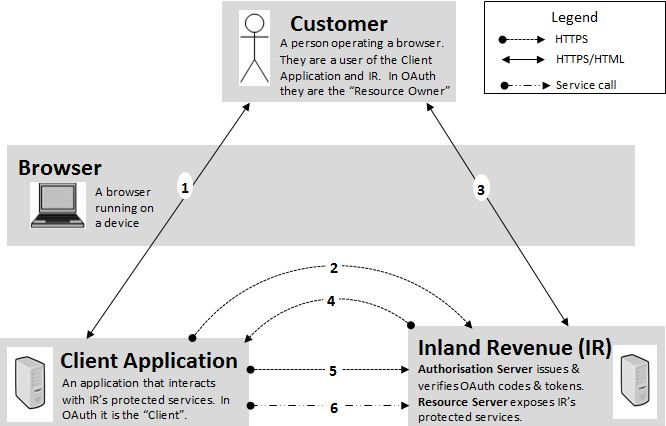
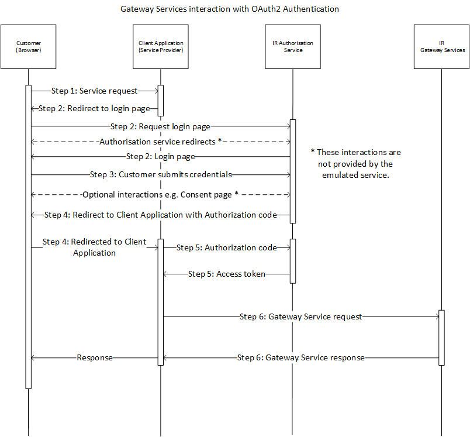

# OAuth Authentication - How to Integrate

#### Table of contents:

* [Simulating Authentication Flow](#simulating-authentication-flow)
* [Full Authentication Steps](#full-authentication-steps)
    * Step 1. Service Request  
    * Step 2. Request Authorisation Code
    * Step 3. Submit Login Credentials
    * Step 4. Redirect to Client Application
    * Step 5. Exchange Authorization Code for an Access Token
* [Call the API Gateway Service](#Call-the-API-Gateway-Service)      
* [Other OAuth Functionality](#Other-OAuth-Functionality)

<a name="simulating-authentication-flow"/>

## Simulating Authentication Flow:
	
High Level Flow

	
Sequence Diagram


<a name="full-authentication-steps"/>

## Full Authentication Steps:

In our gateway services environments OAuth service is used, so as a service provider you would need to trigger customer's behaviour to complete this OAuth flow.

### Step 1. Service Request 
Customer accesses the Client Application via a browser. They take an action that requires access to myIR Gateway Services.

### Step 2. Request Authorisation Code
The Client Application invokes the OAuth Server to get access token, the customer's browser is redirected to myIR login page.
	At this step as a service provider you need to send a ```HTTP GET``` request to OAuth Server, URL format as below:

##### URL Format:
```http
https://{ServiceHostdomain}:{AuthServicePort}/ms_oauth/oauth2/endpoints/oauthservice/authorize
  ?client_id={ClientID}
  &redirect_uri={RedirectURI}
  &scope=MYIR.Services
  &response_type=code
  &state={State}
```
 
Parameters:
* ```{ClientID}```: a valid client identifier
* ```{RedirectURI}```: Client Application's redirect URI
* ```{State}```: **Optional, but recommended** e.g. GUID, arbitrary unique string value created by the Client Application as a method of maintaining state. 
			
> NOTE: 
>
> For the Test and Production environements, the onboaring team will provide you with your Client ID and Client Secret.

### Step 3. Submit Login Credentials
User submits credentials and autothorise consent -  At this step the Client Application will need to send a ```HTTP POST``` request to OAuth Server.

>NOTE: 
>
> The consent page and redirection pages are skipped in this mock environment (emulated service).


##### URL Format:
```http 
https://{ServiceHostdomain}/oam/server/auth_cred_submit
```
		
Parameter:
* ```{ServiceHostdomain}```: this is IR's gateway service environment specific domain that is accessed after your endpoint IP / CIDR range is white-listed. 

>NOTE: 
>
>The production environmnet does not require IP address whitelisting.
		
**HTTP POST** Request headers MUST include:
```http 
Content-Type: application/x-www-form-urlencoded
Cookie: {CookieFromLastStep}
```
		
Request HTTP header and body: 
```http 
POST /oam/server/auth_cred_submit HTTP/1.1
Host: {ServiceHostdomain} 
Cookie: {CookieFromLastStep}
Content-Type: application/x-www-form-urlencoded

userid={CustomerUserID}
&password={CustomerUserPassword}
&login=Login
```

Parameters:

* ```{CustomerUserID}```: myIR User ID
* ```{CustomerUserPassword}```: myIR Password

### Step 4. Redirect to Client Application
Authorization Code returns to Client Application by a ```HTTP 302 redirection``` to the ```{redirectURI}```.

#### Response URL Format:
```http
https://{RedirectURI}?code={AuthorizationCode}&state={State}
```

Parameters:
* ```{RedirectURI}```: Client Application's redirect URI
* ```{AuthorizationCode}```: The Authorization Code to be used for retrieving an access token	
* ```{State}```: The matching string value which was origninally created by the Client Application 

### Step 5. Exchange Authorization Code for an Access Token
Client Application retrieves OAuth Access Token by submits a ```HTTP POST``` request using the Authorization Code as well as client application's credentials

#### URL Format:
```http
https://{ServiceHostdomain}/ms_oauth/oauth2/endpoints/oauthservice/tokens
```
		
Parameters:
* ```{ServiceHostdomain}```: this is IR's gateway service environment specific domain that is accessed after your endpoint IP / CIDR range is white-listed.
* ```{ClientApplicationEncodedCredentials}```: the encoded client application's credentials, must be Base64 encoded. 

>NOTE: 
>
>Request HTTP header must include:
>  ```http
>  Authorization: Basic {ClientApplicationEncodedCredentials}
>  Content-Type: application/x-www-form-urlencoded
>  ``` 

#### Request HTTP header and body: 
```http 
POST /ms_oauth/oauth2/endpoints/oauthservice/tokens HTTP/1.1
Host: {ServiceHostDomain}
Content-Type: application/x-www-form-urlencoded
Authentication: Basic {ClientApplicationEncodedCredentials}

redirect_uri={RedirectURI}
&code={AuthorizationCode}
&grant_type=authorization_code
```

Parameters:
* ```{RedirectURI}```: Client Application's redirect URI. **URI must be URL-encoded.**
* ```{AuthorizationCode}```: the Authorization Code retrieved from last step

Response HTTP Header and body format as below: 
```http
HTTP/1.1 200 OK
Content-Type: application/json

{
    "expires_in":28800,
    "token_type":"Bearer",
    "access_token":"{AuthAccessToken}"
}
```
Parameters:
* ```{AuthAccessToken}```: is the access token string value which is then used in consuming the Gateway Services. 

<a name="Call-the-API-Gateway-Service"/>

## Call the API Gateway Service

Once the Access Token has been obtained it can be used to make calls to the API by passing it as a Bearer Token in the Authorization header of the ```HTTP POST``` request.

Access tokens are the thing that applications use to make API requests on behalf of a user. The access token represents the authorization of a specific application to access specific parts of gateway service.

#### Request HTTP header and body: 
```http 
POST gateway/GWS/Returns/ HTTP/1.1
Host: {ServiceHostDomain}
Content-Type: application/soap+xml
Authentication: Bearer {AuthAccessToken}

<soap:Envelope xmlns:soap="http://www.w3.org/2003/05/soap-envelope">...</soap>
```


##### Native Desktop Application:
```php
curl --request POST \ 
  --url "https://{ServiceHostdomain}/gateway2/GWS/Returns/" 
  --header "Authorization: Bearer {AuthAccessToken}" 
  --header "Content-Type: application/soap+xml" 
  --data @prepoprequest.xml
```


##### Cloud Application (testing & production environments only):
```php
curl --request POST \ 
  --cert {PartnersCert} \ 
  --key {PartnersKey} \
  --url "https://{ServiceHostdomain}:4046/gateway/GWS/Returns/" \
  --header "Authorization: Bearer {AuthAccessToken}" 
  --header "Content-Type: application/soap+xml" 
  -date @prepoprequest.xml
```

Parameters:
* ```{PartnersCert}``` Client certificate file
* ```{PartnersKey}```  Private key file name
* ```{AuthAccessToken}``` Authorization Access Token is from the ```token.txt``` file in Step 5. **Exchange Authorization Code for an Access Token**

>Note:
>
>Access tokens must be kept confidential in transit and in storage. The only parties that should ever see the access token are the application itself, the authorization server, and resource server. The application should ensure the storage of the access token is not accessible to other applications on the same device. The access token can only be used over an https connection, since passing it over a non-encrypted channel would make it trivial for third parties to intercept.

<a name="Other-OAuth-Functionality"/>

## Other OAuth Functionality 

Other OAuth functionality includes:
* [Validate Access Token](Message%20Samples.md#ValidateAccessToken)
* [Request Refresh Token](Message%20Samples.md#RequestRefreshToken)
* [Revoke Access Token](Message%20Samples.md#RevokeTokenRequest)